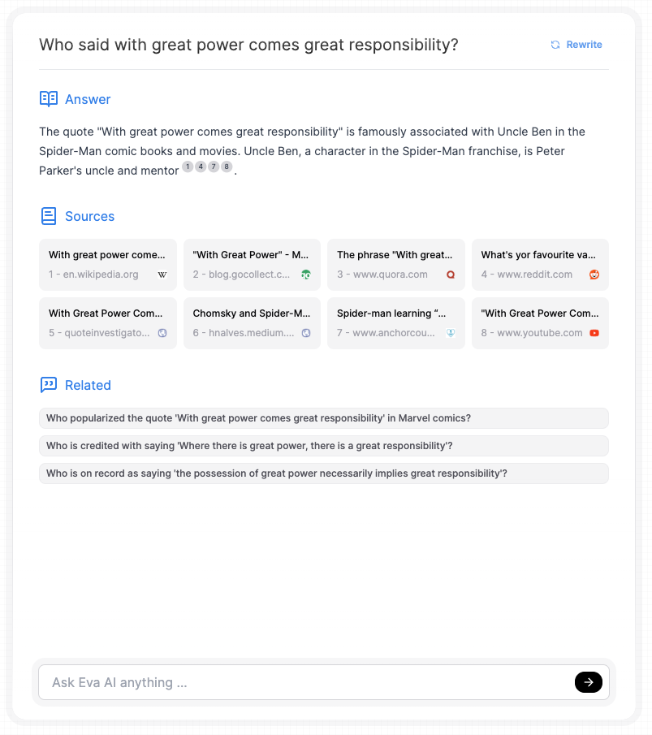

# LlamaSearch

LlamaSearch is a conversational search engine powered by multiple LLM providers, delivering intelligent, context-aware responses with enhanced answer quality through Retrieval-Augmented Generation (RAG). It supports various search backends and provides detailed insights into model performance via Langfuse, offering a comprehensive and transparent search experience.

Best of all, by combining Ollama for local LLM processing and DuckDuckGo for open-source search, users can run a powerful, privacy-respecting search engine entirely on their local machines without any external dependencies or API keys. It is an extension of the search_with_lepton project by LeptonAI.

<div align="center">

<br>  

</div>

## Features

- Built-in support for multiple LLM providers:
  - OpenAI
  - TogetherAI
  - HuggingFace Text Generation Interface (HF_TGI)
  - Ollama
- Integrated search engine capabilities
- Customizable and responsive UI interface
- Retrieval-Augmented Generation (RAG) for improved answer quality
- Related questions generation
- Support for multiple search backends:
  - Google
  - Serper
  - DuckDuckGo
- LLM observability with Langfuse

## Run Locally Without API Keys

One of the main advantages of LlamaSearch is the ability to run it entirely on your local machine without requiring any external API keys. This setup ensures privacy, reduces costs, and allows for complete control over the search and language model processes.

### Local LLM with Ollama

LlamaSearch supports [Ollama](https://ollama.ai/), which allows you to run large language models locally on your own hardware. This means you can have a powerful LLM running on your machine without relying on external API services.

To use Ollama:
1. Install Ollama on your system following their [installation guide](https://github.com/jmorganca/ollama#installation).
2. Set the `CLIENT` environment variable to "OLLAMA" in your `.env` file.
3. Specify the Ollama model you want to use (e.g., "llama2") in the configuration.

### Open-Source Search with DuckDuckGo

LlamaSearch integrates with DuckDuckGo, an open-source search engine that doesn't require an API key. This allows you to perform web searches without relying on proprietary search APIs.

To use DuckDuckGo:
1. Set the `SEARCH_BACKEND` environment variable to "DUCKDUCKGO" in your `.env` file.
2. No additional configuration is needed - it works out of the box!

By combining Ollama for local LLM processing and DuckDuckGo for open-source search, you can run a powerful, privacy-respecting search engine entirely on your local machine without any external dependencies or API keys.

## LLM Observability with Langfuse

LlamaSearch integrates Langfuse for LLM observability, allowing you to monitor, debug, and optimize your language model interactions.

To set up Langfuse:
1. Sign up for a Langfuse account at [langfuse.com](https://langfuse.com)
2. Obtain your Langfuse API keys (public and secret)
3. Add the following environment variables to your `.env` file:
   ```
   langfuse_secret_key=your_secret_key_here
   langfuse_public_key=your_public_key_here
   langfuse_cloud=https://cloud.langfuse.com  # or your self-hosted Langfuse URL
   ```

Once configured, LlamaSearch will automatically send LLM interaction data to Langfuse, allowing you to monitor performance, debug issues, optimize prompts, and track costs associated with LLM API calls.

## Prerequisites

- Python 3.10+
- Node.js 
- npm 

## Installation

1. Clone the repository:
   ```
   git clone https://github.com/yourusername/LlamaSearch.git
   cd LlamaSearch
   ```

2. Set up the environment variables:
   ```
   cp .env_example .env
   ```
   Edit the `.env` file and fill in the required configurations.

3. Install Python dependencies:
   ```
   pip install -r requirements.txt
   ```

4. Install and build the web interface:
   ```
   cd web
   npm install
   npm run build
   ```

## Usage

1. Start the server:
   ```
   cd ..
   python thesearch.py
   ```

2. Open your web browser and navigate to `http://localhost:8282` to use LlamaSearch.

## Configuration

You can configure LlamaSearch by modifying the following environment variables in the `.env` file:

- `SEARCH_BACKEND`: Choose between "GOOGLE", "SERPER", or "DUCKDUCKGO"
- `LLM_PROVIDER`: Set to "OPENAI", "TOGETHER", "HF_TGI", or "OLLAMA"
- `OPENAI_API_KEY`: Your OpenAI API key (if using OpenAI)
- `TOGETHER_API_KEY`: Your TogetherAI API key (if using TogetherAI)
- `HF_API_KEY`: Your Hugging Face TGI server API key (if using HuggingFace Text Generation Interface over a self hosted server)
- `GOOGLE_SEARCH_API_KEY`: Your Google Search API key (if using Google search)
- `GOOGLE_SEARCH_CX`: Your Google Search engine ID
- `SERPER_SEARCH_API_KEY`: Your Serper API key (if using Serper search)
- `langfuse_secret_key`: Your Langfuse secret key
- `langfuse_public_key`: Your Langfuse public key
- `langfuse_cloud`: Langfuse cloud URL or self-hosted instance URL

## Contributing

Contributions are welcome! Please feel free to submit a Pull Request.

## Acknowledgments

- [Lepton AI](https://github.com/leptonai/search_with_lepton) for the search_with_lepton project
- [OpenAI](https://openai.com/) for their language models
- [TogetherAI](https://www.together.ai/) for their AI services
- [Hugging Face](https://huggingface.co/) for their Transformers library
- [Ollama](https://ollama.ai/) for local LLM support
- [DuckDuckGo](https://duckduckgo.com/) for their open-source search engine
- [Langfuse](https://langfuse.com/) for LLM observability